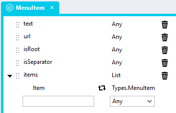
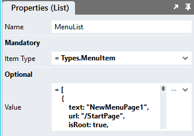

# Dynamic Menus <!-- omit in toc -->

Create menu items from data

https://github.com/user-attachments/assets/75a609ce-e24d-424e-b810-baa006d7cf51

# Version
Initial 1.0

# Setup

## Application Setup
1. Check the *Enable Style Sheet* checkbox in the application properties

## Global Script
1. Create a Global Script called "DynamicMenu"
2. Add the input parameters below to the Global Script
   1. MenuClass
   2. MenuItems
3. Drag a *JavaScript* action into the script
4. Add the Javascript below into the JavaScript code property
```javascript
/* Stadium Script v1.0 https://github.com/stadium-software/dynamic-menu */
let scope = this;
let items = ~.Parameters.Input.MenuItems;
let className = ~.Parameters.Input.MenuClass;
let ob = document.querySelector(".menu-container." + className);
if (!ob) { 
    console.error("The class '" + className + "' needs to be added to the Classes property of a menu.");
    return false;
}
let getObjectName = (obj) => {
    let objname = obj.id.replace("-container", "");
    do {
        let arrNameParts = objname.split(/_(.*)/s);
        objname = arrNameParts[1];
    } while ((objname.match(/_/g) || []).length > 0 && !scope[`${objname}Classes`]);
    return objname;
};
setDMValues(ob, "Items", items);
function setDMValues(ob, property, value) {
    let obname = getObjectName(ob);
    scope[`${obname}${property}`] = value;
}
```

## Type Setup
The type is not strictly required, but can assist in making the implementation more robust.

1. Create a type called "MenuItem"
2. Add the following properties to the type
   1. text (any)
   2. url (any)
   3. isRoot (any)
   4. items (list)
      1. item (Types.MenuItem)

The "items" property is a list of type MenuItem and makes the type recursive. 



## Page or Template Setup
1. Drag a *Menu* control to a page or template
2. Add a classname to the control *Classes* property that uniquely identifies this menu in the application

## Event Handler
Place the script in an event handler that is located on the page or template where the menu is also located
1. Drag a *List* into the event handler
2. Select *Types.MenuItem* in the *Item Type* property dropdown



3. Add items to the list as per the example below
   1. text: The menu item label
   2. url: A link (optional). Internal links must be preceeded by a / (see example below)
   3. isRoot: Must be "true" for all top level (see example below)
   4. items: A list of sub-items

```json
[
	{
		"text": "First Top-Level Item",
		"url": "/StartPage",
		"isRoot": true,
		"items": [
			{
				"text": "First Sub-Item",
				"isRoot": false,
				"items": [
					{
						"text": "First Leaf Item",
						"url": "/StartPage",
						"isRoot": false,
						"items": []
					}
				]
			},
			{
				"text": "Second Sub-Item",
				"isRoot": false,
				"items": [
					{
						"text": "Second Leaf Item",
						"url": "/StartPage",
						"isRoot": false,
						"items": []
					}
				]
			}
		]
	},
	{
		"text": "Second Top-Level Item",
		"url": "/StartPage",
		"isRoot": true,
		"items": []
	}
]
```

4. Drag the "DynamicMenu" script into the event handler and complete the input parameters
   1. MenuClass: The classname that uniquely identifies this menu in the application
   2. MenuItems: The list of items you wish to assign to the menu

## Working with Stadium Repos
Stadium Repos are not static. They change as additional features are added and bugs are fixed. Using the right method to work with Stadium Repos allows for upgrading them in a controlled manner. How to use and update application repos is described here 

[Working with Stadium Repos](https://github.com/stadium-software/samples-upgrading)
